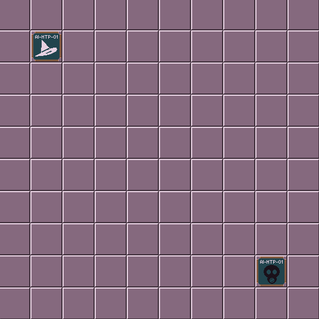

# LDJAM #59 - Signal

## 2026-04-18 11:43 Let's go!

Feeling pretty good about this one. I managed to stay up to 2am to get the theme for the jam. Signal. I'm happy with that one. I wanted to do a Chaos: Battle of the Wizards inspired game and this fits it perfectly. Substitute wizards for hackers, or why not, AI and you have a game!

Downside is that I've slept in and it's 11:43 as I type this and my main machine doesn't have half the tools I need. I'm going to split time between this and my laptop, so that I can code while watching TV. Maybe. We'll see how it goes.

## 2026-04-18 12:33 Virtual (Insanity) Re-write of Core

I started getting my framework ready last night, nothing major just some helper classes. Basically spent the last hour re-writing them. Why? Cos I'm not going for code re-use in this, I just want it to work as a game. Pretty much all the models, the state machine and base components are ready. I still have to re-work spritesheet so that it can be re-used in classes for this game, but that can come later.

## 2026-04-18 15:25 Things are appearing on screen

Had some lunch and back at it. I have the raw states done and can move the game from initialization through to displaying something on screen, and here it is!

Now on to the first action; summoning! I still feel better at this point in the process than any other game jam. I think my idea of coming up with a game type and trying to fit it with the jam has really worked. It gave me a week to basically come up with what I _wanted_ to do. Planning, eh?!
