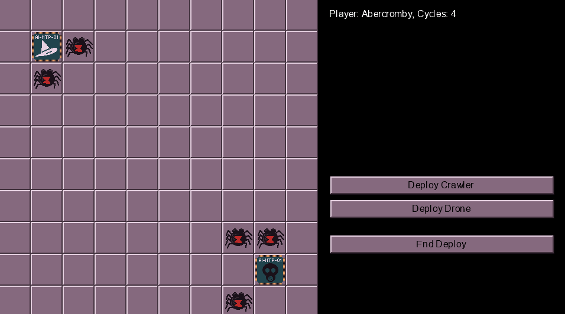
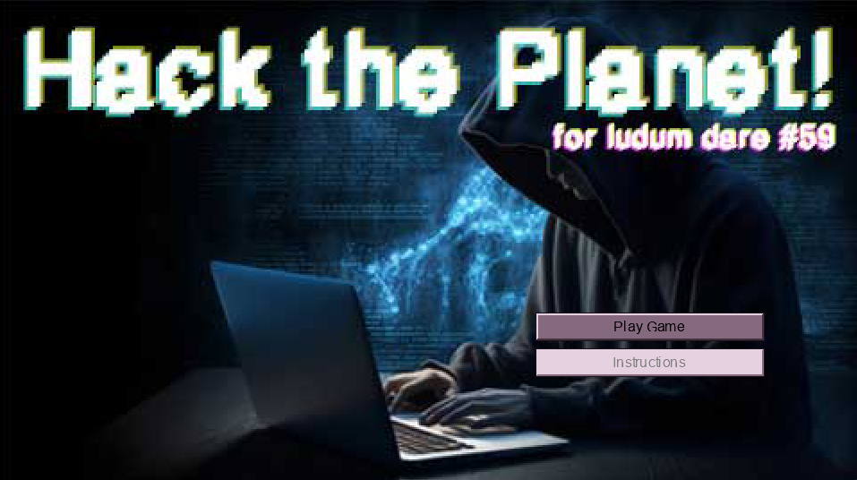
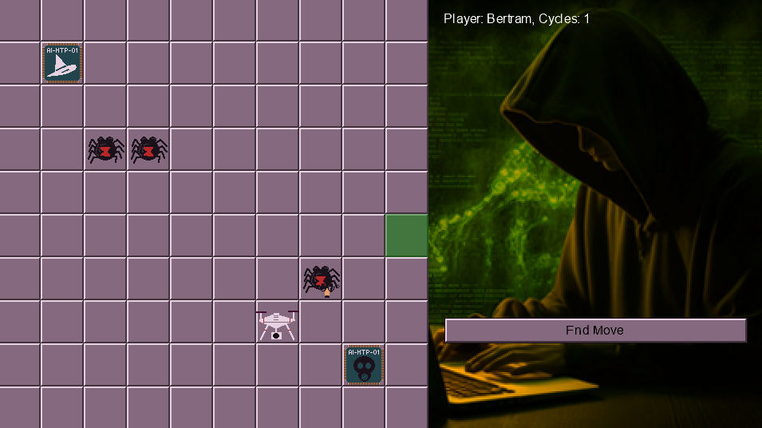

# LDJAM #59 - Signal

## 2026-04-18 11:43 Let's go!

Feeling pretty good about this one. I managed to stay up to 2am to get the theme for the jam. Signal. I'm happy with that one. I wanted to do a Chaos: Battle of the Wizards inspired game and this fits it perfectly. Substitute wizards for hackers, or why not, AI and you have a game!

Downside is that I've slept in and it's 11:43 as I type this and my main machine doesn't have half the tools I need. I'm going to split time between this and my laptop, so that I can code while watching TV. Maybe. We'll see how it goes.

## 2026-04-18 12:33 Virtual (Insanity) Re-write of Core

I started getting my framework ready last night, nothing major just some helper classes. Basically spent the last hour re-writing them. Why? Cos I'm not going for code re-use in this, I just want it to work as a game. Pretty much all the models, the state machine and base components are ready. I still have to re-work spritesheet so that it can be re-used in classes for this game, but that can come later.

## 2026-04-18 15:25 Things are appearing on screen

Had some lunch and back at it. I have the raw states done and can move the game from initialization through to displaying something on screen, and here it is!

Now on to the first action; summoning! I still feel better at this point in the process than any other game jam. I think my idea of coming up with a game type and trying to fit it with the jam has really worked. It gave me a week to basically come up with what I _wanted_ to do. Planning, eh?!

## 2026-04-18 17:14 Two hours on a button!?

But it's an important button. All the menu controls will be through this button, so it's best getting this right just now. On to the actual actions part of this!

## 2026-04-18 19:05 States, states and what a state

Slowly getting there. I am fixating on the smaller details and just need to hammer through. I think I can get to a point tonight where I can deploy something. Make it at least feel like a game. So far, I have a menu system working and when you select "deploy" it changes to a selection cursor; green for you can place this here, red for you can't. Progress!

## 2026-04-18 21:10 Time for a rest. Watch some TV?

I have some gameplay! The players can take turns to place items on the grid. There are currently two "AIs" that control various programs; a crawler and a drone for now. And those can be placed on the grid near the AI. There are a limited number of cycles (think: mana) so you have to watch that resource too. Next up is movement and starting processes (think: spells!) All good stuff.

## 2026-04-19 10:20 Not gonna make it..?

This might be tight, I have five hours left to finish the jam. Maybe some time on Monday? Maybe even a couple of hours tonight? Jams always happen on weekends where plans materialize. It is what it is I guess. Just finished adding the ghosts and hiding them from the other player when it's their screen. The graphics need work, but they will do for now. 

## 2026-04-19 11:01 Movement is working!

Selection and movement works great! The players can now move their pieces on the board using a simple selection mechanic. Select the unit, cursor becomes a yellow square to show where you can move to. I might change that to arrows or something later. Polish stage, if I can get to it. 

## 2026-04-19 12:12 Attack! Attack! Arrrgh! Attack!

Attacking units is working. I've forgotten about running programs. D'oh! That's next, it'll use the same selector thing as before. I should probably work on the interstitial screens too. They look naff. But, for now I've fixed the bugs with movement - you could move a bit further just by flicking the mouse, so it's constrained to when you _first_ clicked. OK, onwards an upwards. Interstitial screen first. Then work on programs. Kill process and threat scan.

## 2026-04-19 12:34 Hackerman

Added a hacker image from [Pixabay](https://pixabay.com/photos/hacker-safety-computer-the-internet-8003394/) to add some spice to the visuals. Makes it a little less boring and now you can see which player is playing. Blue for the white hat hacker, slightly orange for the black hat hacker. I got a font (PixelGrunge) from [dafont.com](https://dafont.com) for the logo.

The title screen and side images are in and it's feeling like the end is in sight. I still need to do a _lot_ of polish and finish off the program run stage too.

Here's some in-game action.

